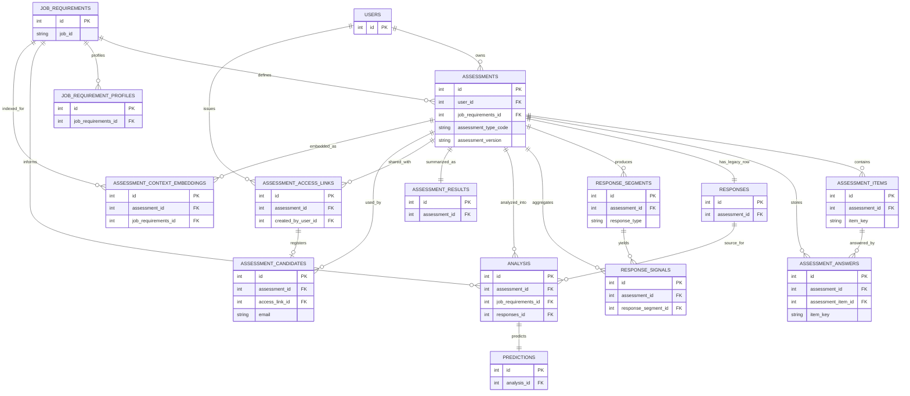
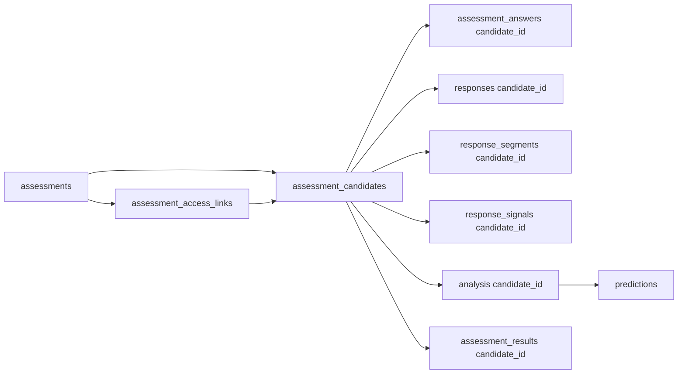

# Database Relationships

This diagram shows the current backend data model around assessments, candidate access, answers, and analysis.

## ER Diagram

## Candidate-Scoped Flow

The analysis pipeline is now intended to be centered on `candidate_id` for interview data, while `assessment_id` remains the shared assessment template/root.

The important chain is:

What this means in practice:

- multiple candidates can exist for one `assessment`
- each candidate should write answers, segments, signals, analysis, and final result rows into their own `candidate_id` scope
- admin listing endpoints can now return one row per candidate without reusing another candidate's analysis
- the remaining shared tables, like `assessments`, `assessment_items`, and `job_requirements`, still describe the reusable assessment definition rather than a specific interview attempt
