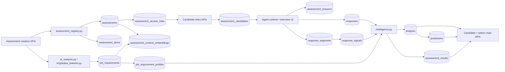
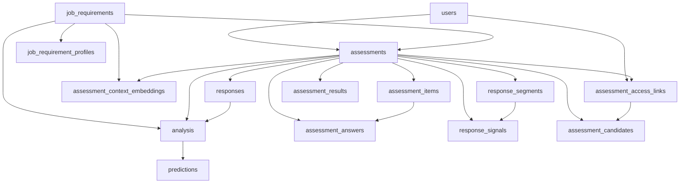
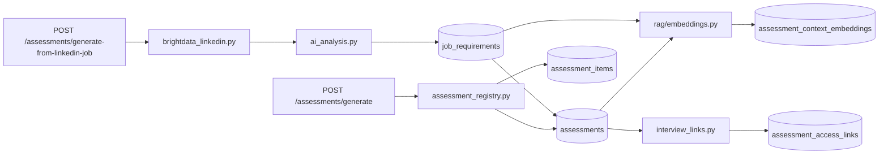
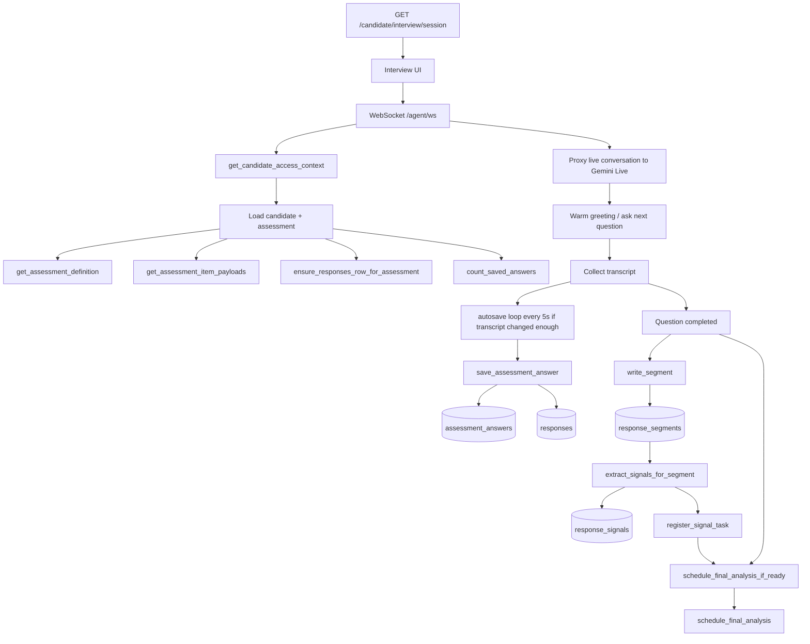
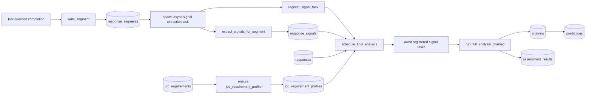
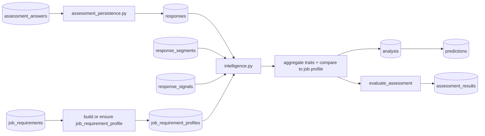
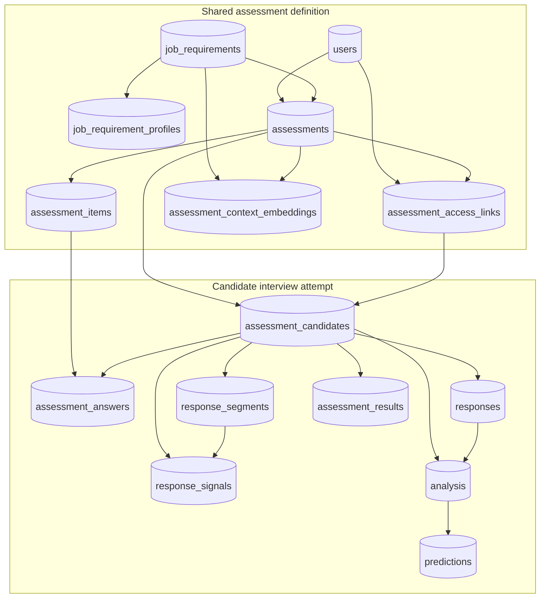
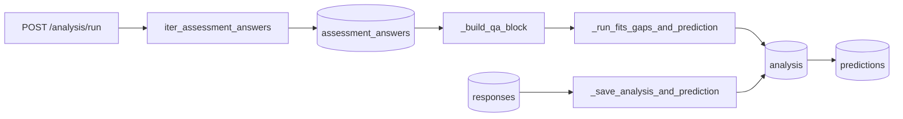

# Leadership Assessment: Full Process, Queue, and Agent Visualization

This document is a fuller visual map of the backend based on `DB_RELATIONSHIPS.md` and the active API and service code in:

- `app/as_blueprinting/routes/assessment.py`
- `app/as_requirements/routes/ai_analysis.py`
- `app/routers/candidate.py`
- `app/routers/intelligence.py`
- `app/as_analysis/routes/analysis.py`
- `app/agent/routes.py`
- `app/services/interview_links.py`
- `app/services/assessment_candidates.py`
- `app/services/assessment_persistence.py`
- `app/services/intelligence.py`
- `app/services/assessment_registry.py`
- `app/rag/embeddings.py`

It includes:

- the full relationship index from `DB_RELATIONSHIPS.md`
- the request flow from assessment generation through invite links, candidate registration, answer capture, agent runtime, async intelligence processing, and final outputs
- the main service modules involved in each stage
- the in-process queue and wait behavior around `response_segments`, `response_signals`, and `schedule_final_analysis`
- the distinction between shared assessment-level tables and candidate-scoped runtime tables

## 1. End-to-end system overview



## 2. Full database relationship index from `DB_RELATIONSHIPS.md`



### Relationship meaning

- `users -> assessments`: the authenticated owner/admin creates the assessment.
- `users -> assessment_access_links`: the owner issues interview invite links.
- `job_requirements -> assessments`: the assessment is built against one job profile.
- `job_requirements -> job_requirement_profiles`: the intelligence layer derives weighted fit expectations from the job requirement.
- `assessments -> assessment_items`: the reusable interview prompts belong to one assessment.
- `assessments -> assessment_answers`: answers are stored against the assessment root, then narrowed by `candidate_id`.
- `assessments -> responses`: the legacy wide-row compatibility record is still maintained.
- `assessments -> response_segments -> response_signals`: transcript fragments are turned into intelligence signals.
- `assessments -> analysis -> predictions`: final analysis is synthesized first, then prediction output is attached to that analysis.
- `assessments -> assessment_results`: denormalized report output for status/reporting flows.
- `assessments -> assessment_access_links -> assessment_candidates`: candidate entry is created via issued links.
- `assessments -> assessment_context_embeddings`: RAG context is indexed from the assessment and job requirement text.

## 3. Process stages and service modules

| Stage | Main endpoints | Main services/modules | Main tables touched |
|---|---|---|---|
| Assessment authoring | `POST /assessments/generate`, `POST /assessments/generate-from-linkedin-job`, `POST /assessments/context` | `assessment_registry.py`, `ai_analysis.py`, `brightdata_linkedin.py`, `assessment_persistence.py`, `rag/embeddings.py` | `job_requirements`, `assessments`, `assessment_items`, `assessment_context_embeddings`, `assessment_access_links` |
| Invite lifecycle | `POST /assessments/{id}/invite-link`, `POST /assessments/{id}/invite-link/revoke`, `GET /assessments/{id}/invite-link/status` | `interview_links.py` | `assessment_access_links`, `assessments`, `users` |
| Candidate registration | `GET /candidate/interview/{token}`, `POST /candidate/interview/{token}/begin` | `assessment_candidates.py`, `interview_links.py` | `assessment_access_links`, `assessment_candidates`, `assessments` |
| Agent interview runtime | `WebSocket /agent/ws`, `GET /candidate/interview/session` | `agent/routes.py`, `assessment_persistence.py`, `assessment_registry.py` | `assessment_candidates`, `assessment_items`, `assessment_answers`, `responses` |
| Intelligence pipeline | `GET /intelligence/assessment/{id}/status`, `POST /intelligence/assessment/{id}/rerun` | `intelligence.py`, `assessment_scoring.py` | `response_segments`, `response_signals`, `job_requirement_profiles`, `analysis`, `predictions`, `assessment_results`, `responses` |
| Read/reporting APIs | `GET /intelligence/assessment/{id}/*`, `GET /candidate/assessment/{id}/*`, `GET /assessments/candidates`, `GET /assessments/user/{user_id}/overview` | `routers/intelligence.py`, `routers/candidate.py`, `assessment_candidates.py` | `analysis`, `predictions`, `assessment_results`, `response_segments`, `response_signals`, `assessment_candidates`, `assessment_access_links` |
| Legacy analysis path | `POST /analysis/run`, `GET /analysis/assessment/{assessment_id}` | `as_analysis/routes/analysis.py`, `assessment_persistence.py` | `responses`, `assessment_answers`, `analysis`, `predictions`, `job_requirements` |

## 4. Assessment creation and setup flow



### What each table serves in this stage

- `job_requirements` serves `assessments` by defining the role context the interview should evaluate.
- `assessments` serves `assessment_items` by acting as the reusable interview root/template.
- `assessment_items` serves later runtime flows by defining the canonical ordered prompts the agent asks.
- `assessment_context_embeddings` serves later agent/context retrieval APIs.
- `assessment_access_links` serves candidate registration by holding invite state until a candidate consumes it.

## 5. Invite links and candidate registration flow

```mermaid
flowchart LR
    A1[Owner issues invite link] --> E1[POST /assessments/{id}/invite-link]
    E1 --> S1[interview_links.py issue_assessment_access_link]
    S1 --> T1[(assessment_access_links)]

    T1 --> C1[GET /candidate/interview/{token}]
    C1 --> S2[assessment_candidates.py get_candidate_registration_context]
    S2 --> C2[POST /candidate/interview/{token}/begin]
    C2 --> S3[assessment_candidates.py register_candidate_for_link]
    S3 --> S4[interview_links.py consume_assessment_access_link]
    S3 --> T2[(assessment_candidates)]
```

### Dependency and wait points

- `assessment_access_links` waits for a valid candidate entry request.
- `assessment_candidates` cannot be created until the access link is validated and consumed.
- `assessment_candidates` becomes the runtime scope key for later `assessment_answers`, `responses`, `response_segments`, `response_signals`, `analysis`, and `assessment_results`.

## 6. Agent interactions and interview runtime

This is the part that was previously compressed too much. The actual interview process includes auth/context loading, websocket proxying, transcript handling, autosave, per-question completion, and background analysis triggering.



### Agent runtime explanation

- `WebSocket /agent/ws` is the live interview channel.
- The websocket first resolves candidate access context, then loads the assessment definition and canonical item payloads.
- `ensure_responses_row_for_assessment` creates the legacy `responses` row early so compatibility-dependent analysis code has something to attach to.
- The websocket proxies the live conversation to Gemini Live.
- Partial transcript autosave runs on a timer, so answers can be persisted before the interview is fully complete.
- `save_assessment_answer` writes the canonical answer row and also syncs compatible legacy fields into `responses`.
- When a question is considered complete, the runtime writes a `response_segment`, then asynchronously extracts `response_signals`.
- Each signal extraction task is registered so final analysis knows what background work is still in flight.
- The websocket can trigger final analysis when the interview reaches the end, when the client disconnects and enough work exists, or when recovery logic notices the agent has advanced past the last question.

## 7. In-process queue and wait behavior



### Queue explanation

- There is no external queue like Redis, Celery, or a separate worker service.
- The queue is implemented with in-memory `asyncio.Task` tracking in `intelligence.py`.
- `_PENDING_SIGNAL_TASKS` tracks outstanding per-segment signal extraction work.
- `_ANALYSIS_TASKS` tracks whether one final analysis task is already running for an assessment or candidate scope.
- `schedule_final_analysis` waits for registered signal tasks before running final analysis.
- If signal tasks are missing or incomplete, the pipeline can rebuild enough state from `responses`.
- This means `response_segments` and `response_signals` are staging tables, while `analysis`, `predictions`, and `assessment_results` are final output tables.

## 8. Intelligence pipeline detail



### What serves what here

- `responses` serves `analysis` because `analysis.responses_id` still anchors analysis rows to the legacy compatibility record.
- `response_segments` serves `response_signals` because signals are extracted from transcript segments.
- `response_signals` serves `analysis` because the final narrative and structured fit/gap reasoning are based on those extracted signals.
- `job_requirement_profiles` serves `analysis` by providing job-fit expectations and weights derived from `job_requirements`.
- `analysis` serves `predictions` because predictions are generated from an already-synthesized analysis row.
- `assessment_results` serves status/reporting APIs as the denormalized summary/report card.

## 9. Read APIs and returned outputs

```mermaid
flowchart LR
    T1[(response_segments)] --> A1[GET /intelligence/assessment/{id}/segments]
    T2[(response_signals)] --> A2[GET /intelligence/assessment/{id}/signals]
    T3[(analysis)] --> A3[GET /intelligence/assessment/{id}/analysis]
    T4[(predictions)] --> A4[GET /intelligence/assessment/{id}/predictions]

    T3 --> B1[GET /candidate/assessment/{id}/analysis]
    T4 --> B2[GET /candidate/assessment/{id}/predictions]
    T5[(assessment_results)] --> B3[GET /candidate/assessment/{id}/status]

    T3 --> C1[GET /assessments/user/{user_id}/overview]
    T4 --> C2[GET /assessments/candidates]
    T5 --> C2
    T6[(assessment_candidates)] --> C2
```

### Important behavior

- `GET /intelligence/assessment/{id}/status` can itself trigger `schedule_final_analysis` if the interview appears complete and analysis is still missing.
- `POST /intelligence/assessment/{id}/rerun` manually dispatches final analysis again using already-collected runtime data.
- Candidate-scoped read APIs always resolve through `assessment_candidates`, while admin/intelligence views can operate at assessment scope or candidate scope depending on query parameters and route behavior.

## 10. Shared tables vs candidate-scoped tables



### Scope interpretation

- Shared tables define the reusable assessment and the hiring target.
- Candidate-scoped tables define one actual interview attempt against that shared assessment.
- `assessment_id` remains the shared root.
- `candidate_id` narrows runtime rows so multiple candidates can run through the same assessment safely.
- `responses` and some legacy paths still preserve backward compatibility, so the runtime has both normalized and compatibility-oriented storage.

## 11. Legacy analysis path that still exists



### Why this matters

- The codebase has two analysis producers:
  - the newer `intelligence.py` async pipeline
  - the older `/analysis/run` path
- Both can write `analysis` and `predictions`.
- That is why `responses` is still on the critical path even though `assessment_answers` is the more canonical answer store.

## 12. Practical summary

- `assessments` is the reusable interview template/root.
- `assessment_items` are the ordered canonical prompts the agent asks.
- `assessment_access_links` waits for candidate consumption and controls interview entry.
- `assessment_candidates` is the candidate runtime identity and scope anchor.
- `assessment_answers` is the canonical normalized answer store.
- `responses` is the legacy compatibility row still required by analysis linkage.
- `response_segments` and `response_signals` are the intelligence staging pipeline.
- `analysis` is the synthesized evaluation record.
- `predictions` is the fit/hiring output attached to one analysis.
- `assessment_results` is the denormalized report/result surface used by status and reporting APIs.

